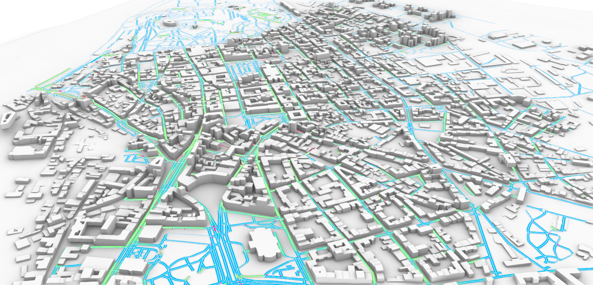

# EUcities

**Purpose**

This notebook employs open source databases to create a shapefile that includes terrain, roads and buildings LOD-1 data, including an estimation of building heights.

**Sources**
* It works for European capitals, the complete list of available cities is available at this link:
https://land.copernicus.eu/local/urban-atlas/building-height-2012?tab=download
* It uses OpenStreetMap data to get the building footprint polygons https://www.openstreetmap.org
* It uses Copernicus Building Height 2012 dataset to get buildings' height, which is available only for European capitals as specified above https://land.copernicus.eu/local/urban-atlas/building-height-2012
* It uses Copernicus EU-DEM v.1.1 data to get terrain data. https://land.copernicus.eu/imagery-in-situ/eu-dem/eu-dem-v1.1

**Outputs**
* 2D shapefile of the roadnetwork
* 2D shapefile of buildingfootprints, which include a field for building heights
* ASCII and tiff file of the clipped terrain
outputs can be combined and extruded in 3D vector software tools, such as Grasshopper for Rhino https://www.grasshopper3d.com/
check also the DTM plugin for Grasshopper to correctly import the terrain:
https://www.food4rhino.com/app/dtm-digital-terrain-mesh

**Requirements**
Python 3.0 with the following libraries:
* osmnx
* geopandas
* pandas
* numpy
* rasterio
* rasterstats

**More specs on building heights calculation**
Building heights are issued from zonal statistics between the building footprints in the selected area and the building heights 2012 raster. Such raster, classifies the heights in 10 bins (2-4, 4-6, 6-8, 8-10, 10-15, 15-20, 20-30, 30-60, 60-100, >100 meters height). Per each building footprint, the weighted average of the number of pixels in a given bin times a random height within the bin range is calculated. This gives the calculated height.

**Use**
* Open the script with Jupyter Notebook. 
* Indicate the work directory and the sampling distance resolution for the raster DEM.
* Create a dictionary containing the cities as keys and a list of OSM regions (relations IDs) as value. 
    * To gather the relation ID of a OSM region, simply go to https://www.openstreetmap.org
    * On the right-side toolbar, select the "query on object" tool, i.e. a mousepointer with a questionmark
    * click on a point on the map
    * scroll the frame that appears on the left to the "encapsulating objects" list
    * select the boundary of interest. It will be highlighted in the map
    * the number in parentheses () after the region name is the relation ID
* Run the script for the chosen city.

**Grasshopper module**
* Once the Python script complete for a given city, open the GH script with Grasshopper (TM) for Rhino (R)
* The Grasshopper plugins DTM, GHSHP, Ladybug and Human are required:
   * DTM https://www.food4rhino.com/app/dtm-digital-terrain-mesh
   * GHSHP https://www.food4rhino.com/app/ghshp
   * Ladybug https://www.food4rhino.com/app/ladybug-tools#downloads_list
   * Human https://www.food4rhino.com/app/human
* Set the main directory path
* The geometry is imported and visualized
* The Sky View Factor is computed through LadyBug and visualized
* Beware the generated file can be heavy
